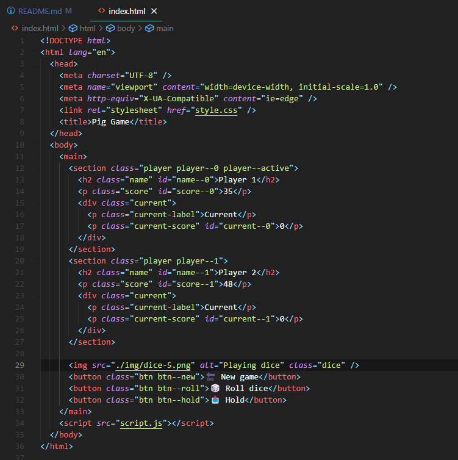
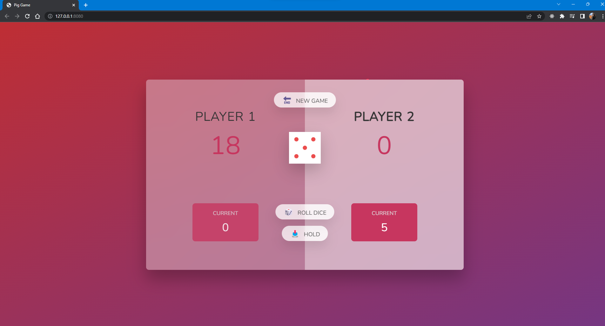
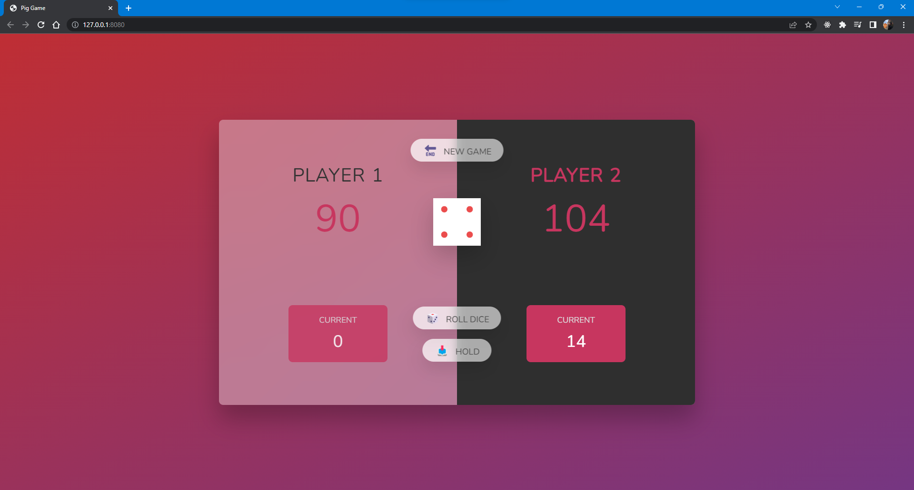

# Pig Game

Creating the famous pig game using JavaScript.

### How it's played

It is two player game, each user should roll the dice if it is their turn.
If the dice number is 1 the current user loses his turn and next user rolls the dice
If the dice number is different than 1 number of dice is being added to current score
If user decides to hold the score, the current score is being added to user's main score
The first user who passes the score of 100, wins the game

### How it is done in JavaScript

First of all UI (html - css) has been created and the class names has been added in clever way.

As you can notice there is two players: player--0 and player--1
The reason it starts with 0 is because it will be useful when we work with arrays to keep track of score in JS.
And as you will see in [script](script.js) this method is really efficient and it makes much more easier to write the logic.

## Preview of the Game

Playing the game

Winning the game

